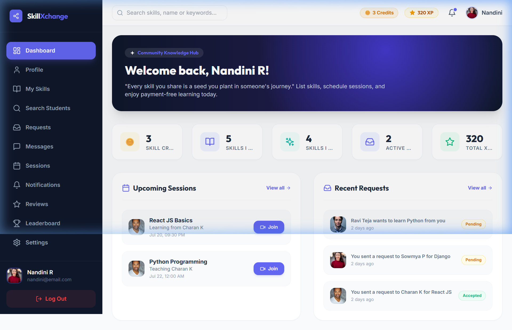
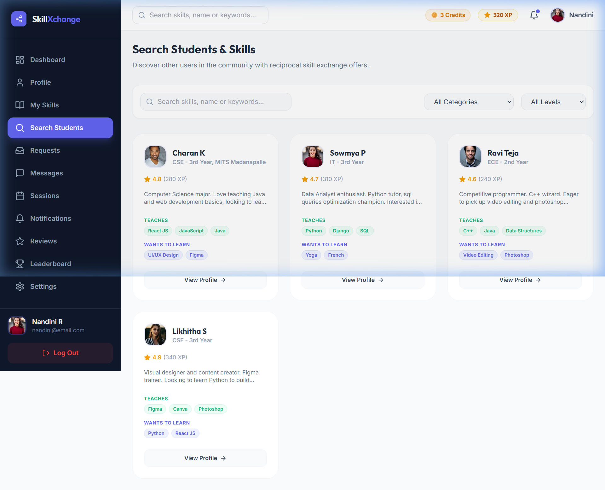
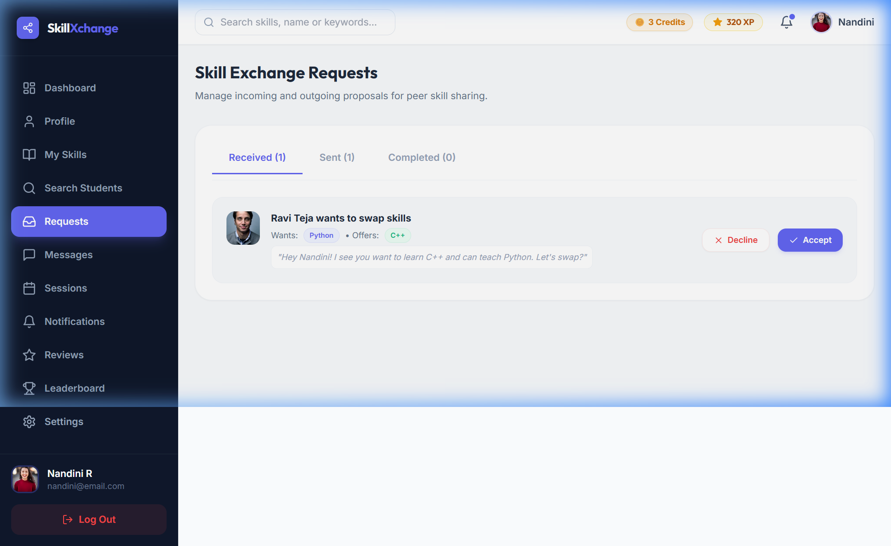
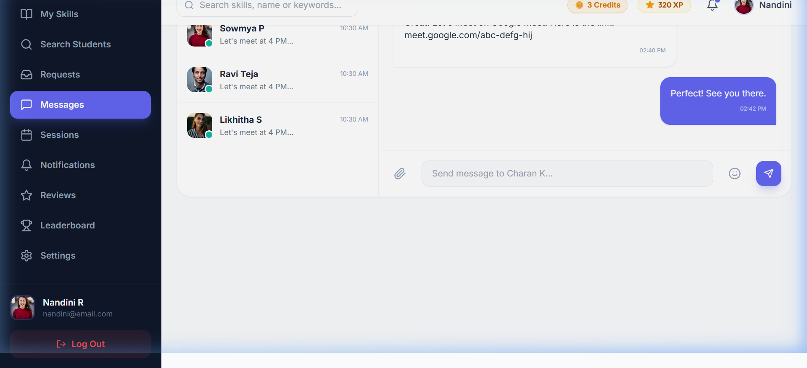

# 🤝 SkillXchange - Peer-to-Peer Student Skill Exchange Platform

**SkillXchange** is a modern, peer-to-peer knowledge-sharing web application built for college students and enthusiasts to trade skills mutually without financial cost. The platform utilizes a reciprocal Skill Credit economy, WebRTC video meeting rooms, live messaging, proposal request management, reputation reviews, and gamified community leaderboards.

---

## 📸 Screenshots Showcase

### 1. Dashboard Overview


### 2. Search Students & Skills (Explore)


### 3. Skill Exchange Requests (Sent & Received)


### 4. Real-time Peer Conversations (Chat)


---

## ✨ Features

- 🔐 **Authentication & Profiles**: Secure JWT authentication with customized user profiles, bio, skill tags, XP points, and Skill Credit balance tracking.
- 🔍 **Skill Explorer**: Discover peers by programming languages, languages, design tools, cooking, fitness, categories, and proficiency levels.
- 📩 **Skill Exchange Proposals**: Send reciprocal swap requests with custom messages. Manage **Received**, **Sent**, and **Completed** proposals in real-time.
- 📅 **Sessions & Scheduling**: Coordinate swap dates, times, and meeting links. Earn +20 XP points upon dual session completion.
- 📹 **Live WebRTC Video Room**: Virtual learning space with camera/microphone controls, screen sharing, session timer, and in-session chat drawer.
- 💬 **Messaging**: Instant peer conversations with unread counts and partner quick-launch profiles.
- ⭐ **Reputation & Reviews**: Star rating system with automated average calculations and student feedback.
- 🏆 **Community Leaderboard**: Monthly and all-time rankings highlighting top student contributors.
- 📱 **Mobile Responsive Design**: Responsive layout with drawer sidebar overlay, bottom mobile navbar, touch-friendly controls, and horizontal scrollable tabs.

---

## 🛠️ Technology Stack

### **Frontend**
- **Framework**: React.js (Vite)
- **Styling**: Tailwind CSS & Custom CSS tokens
- **Icons**: Lucide React Icons
- **Routing**: React Router DOM v6
- **HTTP Client**: Axios

### **Backend**
- **Framework**: Django 4.2 & Django REST Framework
- **Authentication**: djangorestframework-simplejwt
- **Database ORM**: MongoEngine (MongoDB Atlas) & SQLite
- **WSGI Server**: Gunicorn

---

## 🚀 Getting Started

### **Prerequisites**
- Node.js (v18 or higher)
- Python 3.10+
- npm or yarn

---

### **1. Backend Setup**

```bash
# Navigate to backend directory
cd backend

# Install Python dependencies
pip install -r requirements.txt

# Run migrations
python manage.py migrate

# Seed initial database entries (optional)
python seed_atlas.py

# Start Django backend server
python manage.py runserver
```
> The Django backend will run on `http://127.0.0.1:8000/`

---

### **2. Frontend Setup**

```bash
# Navigate to frontend directory
cd frontend

# Install node dependencies
npm install

# Start Vite development server
npm run dev
```
> The frontend dev server will run on `http://localhost:5173/`

---

### **3. Production Build & Network Serving**

```bash
# Build production bundle
cd frontend
npm run build

# Serve network-accessible preview (mobile & desktop)
npm run preview
```
> The preview server will run on `http://localhost:4173/` and `http://<YOUR_IP>:4173/`

---

## 📁 Project Structure

```
Skill Exchange/
├── backend/
│   ├── apps/
│   │   ├── authentication/   # User registration, login, and profiles
│   │   ├── skills/           # Skill catalogs, categories, and search
│   │   ├── exchanges/        # Proposal creation, accept/decline handlers
│   │   ├── chat/             # Message threads and conversation rooms
│   │   └── sessions/         # Meeting schedules, completions, & reviews
│   ├── skillxchange/         # Django settings, WSGI, and URL routing
│   ├── manage.py             # Django management script
│   ├── requirements.txt      # Python dependencies
│   └── Procfile              # Gunicorn web server deployment config
├── frontend/
│   ├── src/
│   │   ├── components/       # Layouts, Sidebar, Navbar, BottomNav
│   │   ├── context/          # AuthContext and state management
│   │   ├── pages/            # Dashboard, Explore, Requests, Chat, VideoRoom, etc.
│   │   ├── services/         # Axios API service integrations
│   │   └── utils/            # Mock data and image utilities
│   ├── vercel.json           # Vercel deployment configuration
│   ├── netlify.toml          # Netlify SPA redirect rules
│   ├── package.json          # Frontend scripts & dependencies
│   └── vite.config.js        # Vite configuration
└── README.md                 # Project documentation
```

---

## ⚡ Continuous Integration & Deployment (CI/CD)

SkillXchange is configured with automated CI/CD continuous integration and deployment pipelines across **GitHub Actions**, **Vercel**, and **Render**.

```
[ Local Code Change ]
         │
         ▼
[ git push origin main ]
         │
         ├───► GitHub Actions (Runs tests & builds frontend/backend)
         │
         ├───► Vercel (Auto-deploys Frontend to production URL)
         │
         └───► Render (Auto-deploys Django Backend Service with zero downtime)
```

### **Automated Deployment Workflow**
1. **Push Changes**: Simply commit and push code to the `main` branch of your GitHub repository:
   ```bash
   git add .
   git commit -m "Your feature updates"
   git push origin main
   ```
2. **Vercel Automatic Deployment**:
   - Vercel automatically detects the push to `main` branch.
   - Executes `npm run build` in the `frontend` root directory.
   - Promotes the new build to production URL `https://frontend-silk-chi-97.vercel.app` with instant global edge caching.
3. **Render Automatic Deployment**:
   - Render automatically pulls the latest commit.
   - Executes `pip install -r requirements.txt && python manage.py migrate`.
   - Performs zero-downtime rolling restart using Gunicorn WSGI.
4. **GitHub Actions Verification**:
   - Runs automated pipeline defined in [.github/workflows/ci.yml](file:///.github/workflows/ci.yml) to run test suites and verify build integrity.

### **Zero-Downtime & Rollback Guarantee**
- If a build fails on Vercel or Render due to a syntax or test error, the deployment is automatically rejected and the previous stable version remains running without downtime.

### **Triggering Manual Redeployments**
- **Vercel**: Visit your [Vercel Project Dashboard](https://vercel.com/narasimhulurachepalli-rnrs-projects/frontend) $\rightarrow$ Deployments $\rightarrow$ Click `Redeploy`.
- **Render**: Visit your [Render Dashboard](https://dashboard.render.com) $\rightarrow$ Select `skillxchange-backend` $\rightarrow$ Click `Manual Deploy` $\rightarrow$ `Deploy latest commit`.

---

## 📄 License

This project is open-source under the MIT License.
